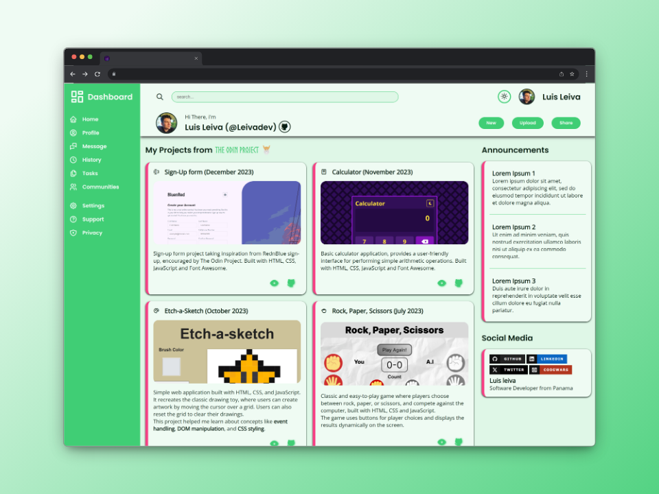

# Admin Dashboard - TOP

## [Try the demo!](https://leivadev.github.io/admin-dashboard-TOP/)

## 📃 About the project

Hey there!👋🏼 Welcome to this basic dashboard layout crafted with grid CSS. This project aims to provide a simple yet effective user interface for plenty of apps. The design is inspired by the principles taught in [The Odin Project's](https://www.theodinproject.com/lessons/node-path-intermediate-html-and-css-admin-dashboard) lessons on intermediate HTML and CSS for the admin dashboard.

## 🔧 Built with

- HTML
- CSS
- JavaScript
- Tabler Icons

## Contributing

Feel free to explore and modify the code to fit your project's needs. If you encounter any issues or have suggestions for improvements, please open an issue or submit a pull request 🙌🏼.

## 💯 Acknowledgments

- Inspirations:
  - [Dean Wagner Dashboard Repo](https://github.com/deanwagner/dashboard)
- Icons: [Tabler Icons](https://tabler.io/icons)
- Mockups: [shots.so](https://shots.so/)

## 👨🏼‍💻 Author

### Luis Leiva - Software Developer from Panama

